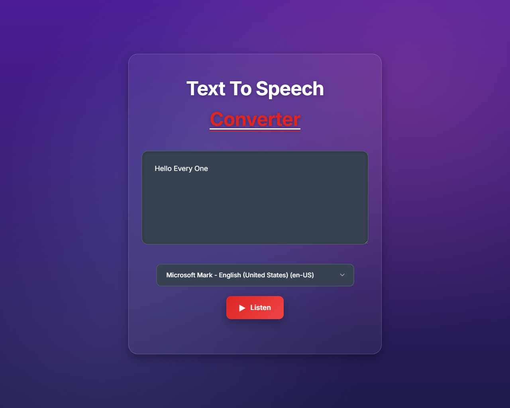

# Text To Speech Converter

A modern, responsive text-to-speech converter built with HTML, CSS, and JavaScript. This project uses the Web Speech API to convert text into natural-sounding speech with multiple voice options.

## ✨ Features

- **🎤 Real-time Text-to-Speech**: Convert any text to speech instantly
- **🌍 Multiple Voice Options**: Choose from various system voices and languages
- **🎨 Modern UI Design**: Beautiful dark theme with glassmorphism effects
- **📱 Fully Responsive**: Works perfectly on all devices and screen sizes
- **⚡ Instant Conversion**: No delays, immediate speech synthesis
- **🎭 Voice Selection**: Dropdown menu with all available system voices
- **✨ Smooth Animations**: Elegant hover effects and transitions
- **🔊 High Quality**: Uses browser's native speech synthesis engine

## 🚀 Live Demo

[View Live Demo]()

## 📸 Screenshots



## 🛠️ Technologies Used

- **HTML5**: Semantic markup and structure
- **CSS3**: Modern styling with CSS Grid, Flexbox, and animations
- **JavaScript (ES6+)**: Web Speech API integration
- **Web Speech API**: Native browser speech synthesis
- **Responsive Design**: Mobile-first approach

## 📁 Project Structure

```
[20] Make Text To Voice Converter/
├── 📖 README.md
├── 🌐 index.html          # Main HTML structure
├── 🎨 style.css           # Styling and animations
├── ⚡ main.js             # Speech synthesis logic
└── 📁 images/             # Screenshots and assets
```

## 🎯 How It Works

### Core Functionality

1. **Text Input**: Users type or paste text into the textarea
2. **Voice Selection**: Choose from available system voices via dropdown
3. **Speech Synthesis**: Web Speech API converts text to speech
4. **Audio Output**: Browser plays the synthesized speech

### Technical Implementation

- **SpeechSynthesisUtterance**: Creates speech objects with configurable properties
- **Voice Management**: Dynamically populates voice options from system
- **Event Handling**: Manages speech start, end, and error events
- **Responsive UI**: Adapts to different screen sizes and devices

### Usage

1. **Enter Text**: Type or paste text in the textarea
2. **Select Voice**: Choose your preferred voice from the dropdown
3. **Click Listen**: Press the red "Listen" button to hear your text
4. **Enjoy**: Your text will be converted to speech instantly


### Styling Changes

- **Colors**: Update CSS variables in `:root`
- **Animations**: Modify keyframes and transition properties
- **Layout**: Adjust container widths and spacing

## 🌐 Browser Support

| Browser | Support | Notes                             |
| ------- | ------- | --------------------------------- |
| Chrome  | ✅ Full | Best support, all features work   |
| Firefox | ✅ Full | Good support, most features work  |
| Safari  | ✅ Full | Good support on macOS             |
| Edge    | ✅ Full | Chromium-based, excellent support |
| IE      | ❌ None | No Web Speech API support         |

## 📱 Responsive Design

The converter is fully responsive with breakpoints at:

- **Desktop**: 1200px and above
- **Tablet**: 768px - 1199px
- **Mobile**: 320px - 767px

## 🤝 Contributing

Contributions are welcome! Here's how you can help:

1. **Fork** the repository
2. **Create** a feature branch
3. **Make** your changes
4. **Test** thoroughly
5. **Submit** a pull request

---

**Made with ❤️ by Ahmad Abdallah**

_Built for the 30-Day-30-Projects Challenge_
